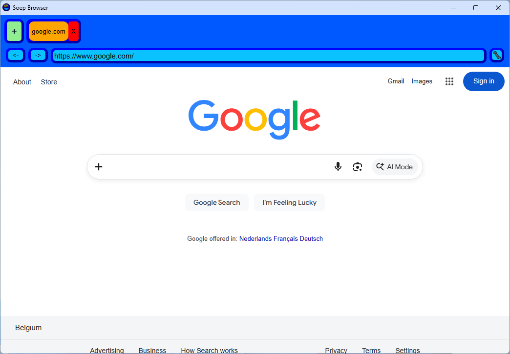

# SoepBrowser

A simple open-source browser built with NW.js.

## Features

- Simple
- Easily customizable
- No data collection

## Installation

- Go to releases
- Download and run **"Soep Browser installer.exe"**
- Go through the install wizard
- Done!

## Development

A version of NW.js is required to test the browser. Download NW.js at:  [https://nwjs.io](https://nwjs.io)

Download the folder `app`

Put the contents of the downloaded folder into the root of the NW.js installation.

Inside the `browser` folder are all the frontend files.

To test run `nw.exe`

## To do

- Better icons
- Bookmarks
- Save last open tabs option
