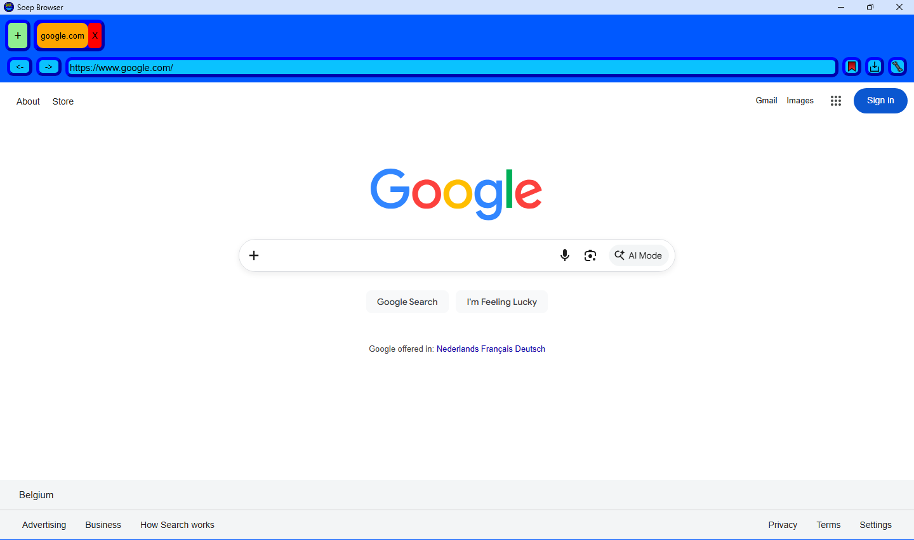

# Soep Browser

A simple open-source browser built with NW.js.

## Features

- Simple
- Easily customizable
- No data collection

## Installation

- Go to releases
- Download and run **"Soep Browser installer.exe"**
- Go through the install wizard
- Done!

## Development Setup

A version of NW.js is required to test the browser.

NW.js version 0.113.0 is recommended.
Note: NW.js 0.114.0 causes the button hover effect to render incorrectly.

Download NW.js at:  [https://nwjs.io](https://nwjs.io)

Download the folder `app`

Put the contents of the downloaded folder into the root of the NW.js installation.

To test run `nw.exe`

## TODO

- Better icons
- Bookmarks
- Save last open tabs option
